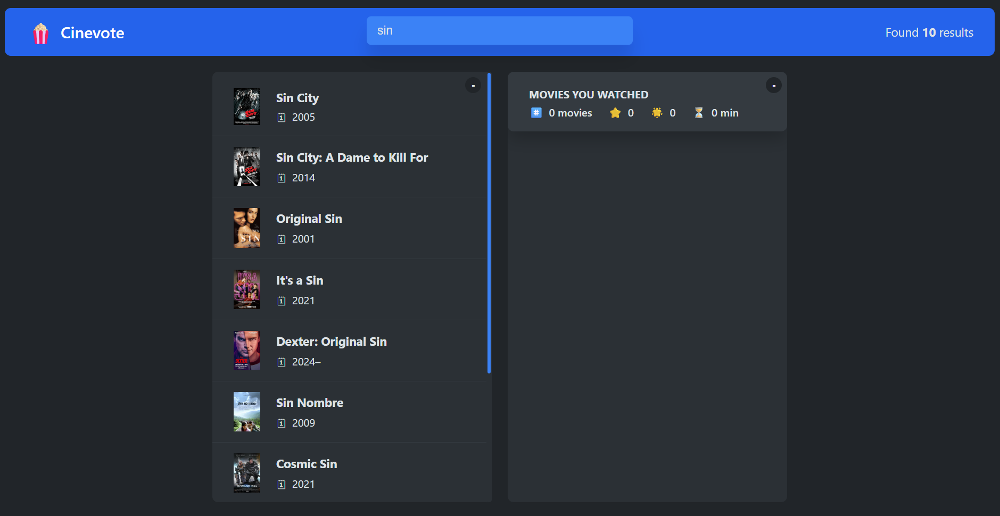
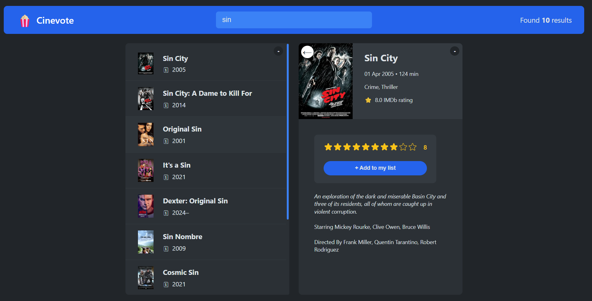
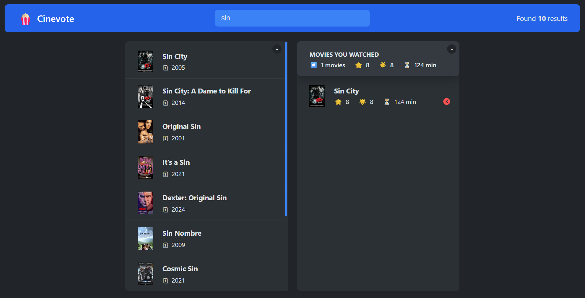

# CineVote 🎬

A small React project for learning purposes, focusing on state management, components, and modern React hooks.

## 🧩 Features

- Fetch and display movie data (static or API-ready)
- Allow users to vote on movies
- Display vote counts
- Responsive UI

## ⚙️ Technologies Used

- React (functional components)
- React Hooks (useState, useEffect)
- CSS Modules
- JavaScript (ES6+)

## 🖼️ Screenshots

Below are a few screenshots of the current UI:

  
*Home screen*

  
*Movie details*

  
*Rating component*

  
*Home screen with watched movie list*


## 🚀 Getting Started

```bash
git clone https://github.com/karo91161/cinevote.git
cd cinevote
npm install
npm start
